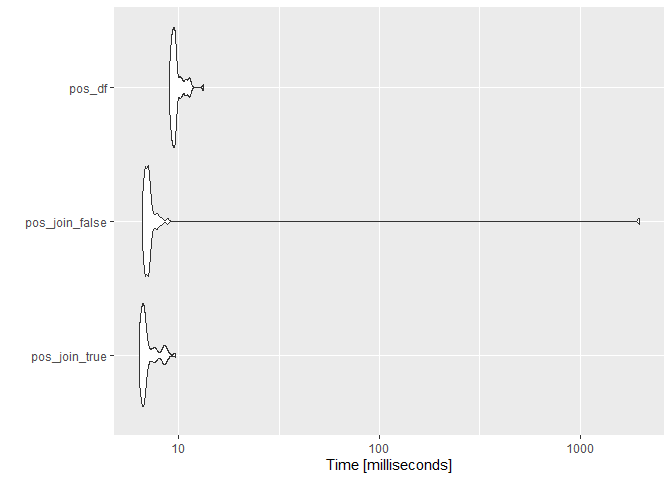
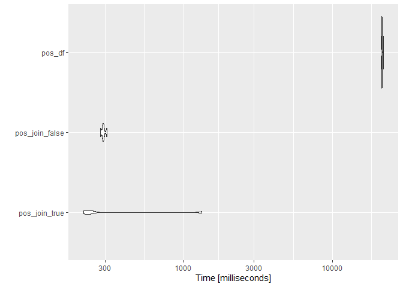
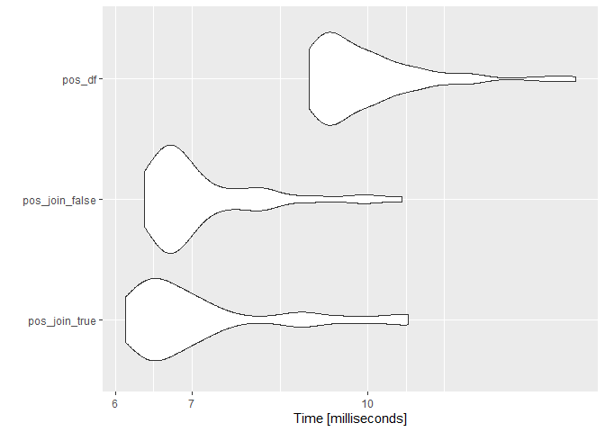
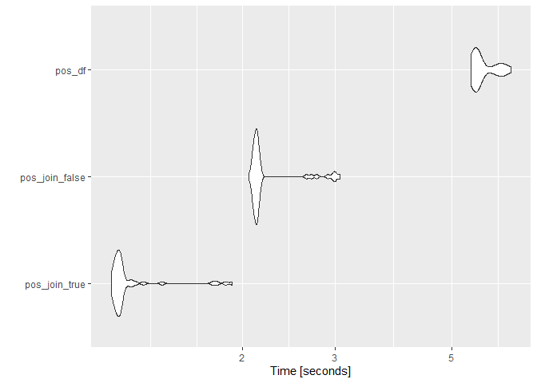
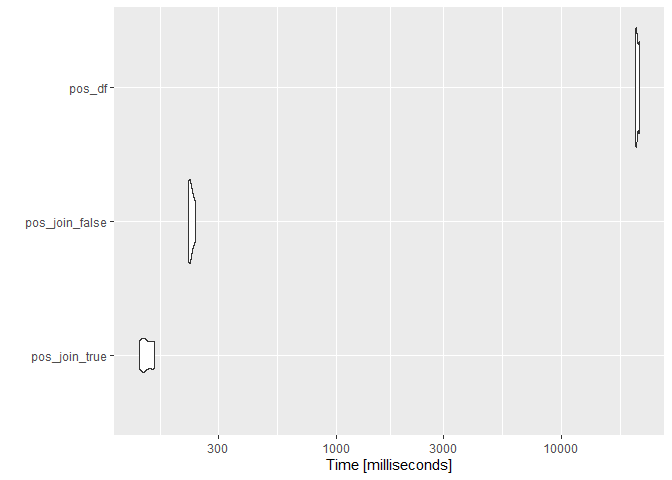

RcppMeCab bench using Japanese MeCab
================
2021-02-18

``` r
corp <- quanteda.corpora::download("data_corpus_foreignaffairscommittee")
text <- tail(quanteda::texts(corp), 100)
long_text <- paste0(text[1:50], collapse = "")

remove(corp)

dplyr::glimpse(text)
#>  Named chr [1:100] "○吉良委員　よろしくお願いします。\n　かつて我が国が日中戦争を行い、その後太平洋戦争に突入していく中で、アメリ"| __truncated__ ...
#>  - attr(*, "names")= chr [1:100] "text287199" "text287200" "text287201" "text287202" ...
```

## pos

### String

``` r
tm <- microbenchmark::microbenchmark(
  pos_join_true = RcppMeCab::pos(text[1], join = TRUE),
  pos_join_false = RcppMeCab::pos(text[1], join = FALSE),
  pos_df = RcppMeCab::pos(text[1], format = "data.frame"),
  times = 50L
)

summary(tm)
#>             expr    min     lq      mean  median     uq       max neval
#> 1  pos_join_true 6.3695 6.5808  7.018190 6.69575 7.1758    9.6784    50
#> 2 pos_join_false 6.6223 6.8239 46.586004 7.06145 7.1486 1981.3800    50
#> 3         pos_df 8.9634 9.2747  9.760782 9.52020 9.7479   13.3233    50
```

``` r
ggplot2::autoplot(tm)
#> Coordinate system already present. Adding new coordinate system, which will replace the existing one.
```

<!-- -->

### String (Long)

``` r
tm <- microbenchmark::microbenchmark(
  pos_join_true = RcppMeCab::pos(long_text, join = TRUE),
  pos_join_false = RcppMeCab::pos(long_text, join = FALSE),
  pos_df = RcppMeCab::pos(long_text, format = "data.frame"),
  times = 50L
)

summary(tm)
#>             expr      min       lq     mean   median       uq      max neval
#> 1  pos_join_true 1.236762 1.288024 1.398183 1.354428 1.463059 1.873788    50
#> 2 pos_join_false 2.118810 2.163172 2.298868 2.179817 2.203575 6.842830    50
#> 3         pos_df 5.566258 5.655860 5.779604 5.737619 5.912812 6.179489    50
```

``` r
ggplot2::autoplot(tm)
#> Coordinate system already present. Adding new coordinate system, which will replace the existing one.
```

<!-- -->

### Character Vector

``` r
tm <- microbenchmark::microbenchmark(
  pos_join_true = RcppMeCab::pos(text, join = TRUE),
  pos_join_false = RcppMeCab::pos(text, join = FALSE),
  pos_df = RcppMeCab::pos(text, format = "data.frame"),
  times = 5L
)

summary(tm)
#>             expr        min         lq       mean     median         uq        max neval
#> 1  pos_join_true   215.9691   219.8504   452.6224   241.6766   245.0024  1340.6136     5
#> 2 pos_join_false   280.9097   289.4020   293.3285   292.4808   295.0683   308.7817     5
#> 3         pos_df 21232.5104 21449.4042 21566.6831 21521.2507 21553.8221 22076.4280     5
```

``` r
ggplot2::autoplot(tm)
#> Coordinate system already present. Adding new coordinate system, which will replace the existing one.
```

<!-- -->

## posParallel

### String

``` r
tm <- microbenchmark::microbenchmark(
  pos_join_true = RcppMeCab::posParallel(text[1], join = TRUE),
  pos_join_false = RcppMeCab::posParallel(text[1], join = FALSE),
  pos_df = RcppMeCab::posParallel(text[1], format = "data.frame"),
  times = 50L
)

summary(tm)
#>             expr    min     lq      mean  median      uq     max neval
#> 1  pos_join_true 6.1223 6.4019  7.228702 6.71580  7.3419 10.8512    50
#> 2 pos_join_false 6.3606 6.6383  7.213758 6.81710  7.4710 10.7092    50
#> 3         pos_df 8.8754 9.1770 10.024234 9.54725 10.3159 15.2211    50
```

``` r
ggplot2::autoplot(tm)
#> Coordinate system already present. Adding new coordinate system, which will replace the existing one.
```

<!-- -->

### String (Long)

``` r
tm <- microbenchmark::microbenchmark(
  pos_join_true = RcppMeCab::posParallel(long_text, join = TRUE),
  pos_join_false = RcppMeCab::posParallel(long_text, join = FALSE),
  pos_df = RcppMeCab::posParallel(long_text, format = "data.frame"),
  times = 50L
)

summary(tm)
#>             expr      min       lq     mean   median       uq      max neval
#> 1  pos_join_true 1.124905 1.147030 1.223387 1.164448 1.180916 1.910205    50
#> 2 pos_join_false 2.054595 2.101885 2.239242 2.126412 2.152858 3.058862    50
#> 3         pos_df 5.427598 5.548076 5.728391 5.576921 6.003428 6.474896    50
```

``` r
ggplot2::autoplot(tm)
#> Coordinate system already present. Adding new coordinate system, which will replace the existing one.
```

<!-- -->

### Character Vector

``` r
tm <- microbenchmark::microbenchmark(
  pos_join_true = RcppMeCab::posParallel(text, join = TRUE),
  pos_join_false = RcppMeCab::posParallel(text, join = FALSE),
  pos_df = RcppMeCab::posParallel(text, format = "data.frame"),
  times = 5L
)

summary(tm)
#>             expr        min         lq       mean     median         uq        max neval
#> 1  pos_join_true   133.2716   138.2676   144.2467   141.0997   153.2574   155.3370     5
#> 2 pos_join_false   219.3761   221.1001   226.2449   224.7514   229.4186   236.5784     5
#> 3         pos_df 21326.7326 21477.5580 21775.0529 21612.8717 22196.9599 22261.1425     5
```

``` r
ggplot2::autoplot(tm)
#> Coordinate system already present. Adding new coordinate system, which will replace the existing one.
```

<!-- -->

## sessioninfo

``` r
sessioninfo::session_info()
#> - Session info ----------------------------------------------------------------------------------
#>  setting  value                       
#>  version  R version 4.0.2 (2020-06-22)
#>  os       Windows 10 x64              
#>  system   x86_64, mingw32             
#>  ui       RStudio                     
#>  language (EN)                        
#>  collate  Japanese_Japan.932          
#>  ctype    Japanese_Japan.932          
#>  tz       Asia/Tokyo                  
#>  date     2021-02-18                  
#> 
#> - Packages --------------------------------------------------------------------------------------
#>  ! package          * version   date       lib source                                    
#>    assertthat         0.2.1     2019-03-21 [1] CRAN (R 4.0.2)                            
#>    backports          1.2.1     2020-12-09 [1] CRAN (R 4.0.3)                            
#>    cli                2.3.0     2021-01-31 [1] CRAN (R 4.0.2)                            
#>    colorspace         2.0-0     2020-11-11 [1] CRAN (R 4.0.3)                            
#>    crayon             1.4.1     2021-02-08 [1] CRAN (R 4.0.2)                            
#>    data.table         1.13.6    2020-12-30 [1] CRAN (R 4.0.3)                            
#>    DBI                1.1.1     2021-01-15 [1] CRAN (R 4.0.3)                            
#>    digest             0.6.27    2020-10-24 [1] CRAN (R 4.0.3)                            
#>    dplyr              1.0.4     2021-02-02 [1] CRAN (R 4.0.3)                            
#>    ellipsis           0.3.1     2020-05-15 [1] CRAN (R 4.0.2)                            
#>    evaluate           0.14      2019-05-28 [1] CRAN (R 4.0.2)                            
#>    farver             2.0.3     2020-01-16 [1] CRAN (R 4.0.2)                            
#>    fastmatch          1.1-0     2017-01-28 [1] CRAN (R 4.0.0)                            
#>    generics           0.1.0     2020-10-31 [1] CRAN (R 4.0.3)                            
#>    ggplot2            3.3.3     2020-12-30 [1] CRAN (R 4.0.3)                            
#>    glue               1.4.2     2020-08-27 [1] CRAN (R 4.0.3)                            
#>    gtable             0.3.0     2019-03-25 [1] CRAN (R 4.0.2)                            
#>    highr              0.8       2019-03-20 [1] CRAN (R 4.0.2)                            
#>    htmltools          0.5.1.1   2021-01-22 [1] CRAN (R 4.0.3)                            
#>    knitr              1.31      2021-01-27 [1] CRAN (R 4.0.3)                            
#>    lattice            0.20-41   2020-04-02 [2] CRAN (R 4.0.2)                            
#>    lifecycle          1.0.0     2021-02-15 [1] CRAN (R 4.0.2)                            
#>    magrittr           2.0.1     2020-11-17 [1] CRAN (R 4.0.3)                            
#>    Matrix             1.3-2     2021-01-06 [1] CRAN (R 4.0.2)                            
#>    microbenchmark     1.4-7     2019-09-24 [1] CRAN (R 4.0.3)                            
#>    munsell            0.5.0     2018-06-12 [1] CRAN (R 4.0.2)                            
#>    pillar             1.4.7     2020-11-20 [1] CRAN (R 4.0.3)                            
#>    pkgconfig          2.0.3     2019-09-22 [1] CRAN (R 4.0.2)                            
#>    purrr              0.3.4     2020-04-17 [1] CRAN (R 4.0.2)                            
#>    quanteda           2.1.2     2020-09-23 [1] CRAN (R 4.0.3)                            
#>    quanteda.corpora   0.9.2     2021-02-18 [1] Github (quanteda/quanteda.corpora@ec4b76d)
#>    R.cache            0.14.0    2019-12-06 [1] CRAN (R 4.0.3)                            
#>    R.methodsS3        1.8.1     2020-08-26 [1] CRAN (R 4.0.3)                            
#>    R.oo               1.24.0    2020-08-26 [1] CRAN (R 4.0.3)                            
#>    R.utils            2.10.1    2020-08-26 [1] CRAN (R 4.0.3)                            
#>    R6                 2.5.0     2020-10-28 [1] CRAN (R 4.0.3)                            
#>    Rcpp               1.0.6     2021-01-15 [1] CRAN (R 4.0.3)                            
#>    RcppMeCab          0.0.1.3-2 2021-02-18 [1] Github (junhewk/RcppMeCab@e1800aa)        
#>  D RcppParallel       5.0.2     2020-06-24 [1] CRAN (R 4.0.2)                            
#>    rlang              0.4.10    2020-12-30 [1] CRAN (R 4.0.3)                            
#>    rmarkdown          2.6       2020-12-14 [1] CRAN (R 4.0.3)                            
#>    scales             1.1.1     2020-05-11 [1] CRAN (R 4.0.2)                            
#>    sessioninfo        1.1.1     2018-11-05 [1] CRAN (R 4.0.2)                            
#>    stopwords          2.2       2021-02-10 [1] CRAN (R 4.0.2)                            
#>    stringi            1.5.3     2020-09-09 [1] CRAN (R 4.0.3)                            
#>    stringr            1.4.0     2019-02-10 [1] CRAN (R 4.0.2)                            
#>    styler             1.3.2     2020-02-23 [1] CRAN (R 4.0.3)                            
#>    tibble             3.0.6     2021-01-29 [1] CRAN (R 4.0.3)                            
#>    tidyselect         1.1.0     2020-05-11 [1] CRAN (R 4.0.2)                            
#>    vctrs              0.3.6     2020-12-17 [1] CRAN (R 4.0.3)                            
#>    withr              2.4.1     2021-01-26 [1] CRAN (R 4.0.3)                            
#>    xfun               0.21      2021-02-10 [1] CRAN (R 4.0.2)                            
#>    yaml               2.2.1     2020-02-01 [1] CRAN (R 4.0.0)                            
#> 
#> [1] C:/Users/user/Documents/R/win-library/4.0
#> [2] C:/Program Files/R/R-4.0.2/library
#> 
#>  D -- DLL MD5 mismatch, broken installation.
```
