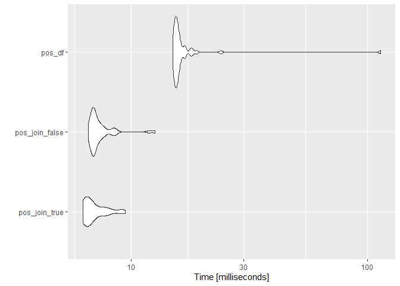
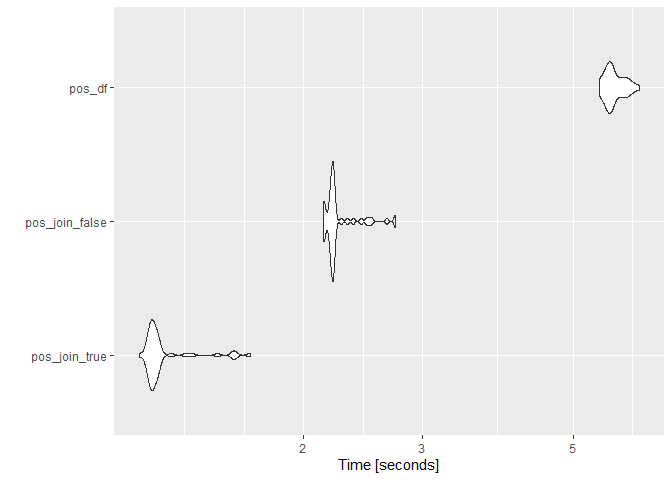
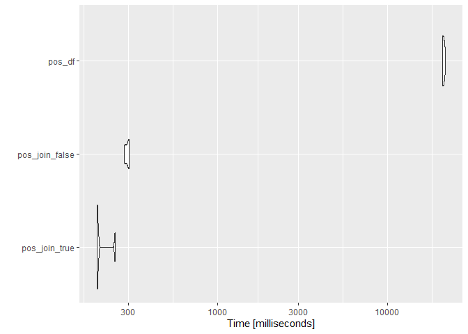
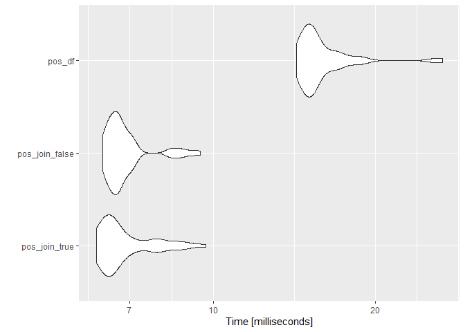
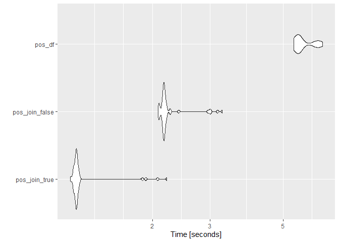
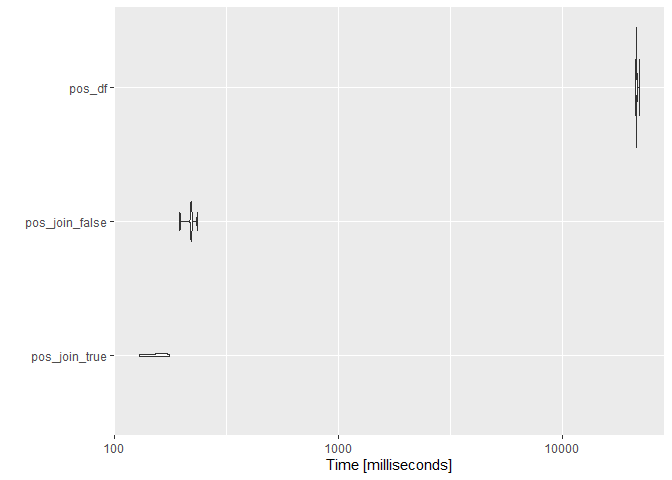

RcppMeCab bench using Japanese MeCab
================
2021-02-18

``` r
corp <- quanteda.corpora::download("data_corpus_foreignaffairscommittee")
text <- tail(quanteda::texts(corp), 100)
long_text <- paste0(text[1:50], collapse = "")

remove(corp)

dplyr::glimpse(text)
#>  Named chr [1:100] "○吉良委員　よろしくお願いします。\n　かつて我が国が日中戦争を行い、その後太平洋戦争に突入していく中で、アメリ"| __truncated__ ...
#>  - attr(*, "names")= chr [1:100] "text287199" "text287200" "text287201" "text287202" ...
```

## pos

### String

``` r
tm <- microbenchmark::microbenchmark(
  pos_join_true = RcppMeCab::pos(text[1], join = TRUE),
  pos_join_false = RcppMeCab::pos(text[1], join = FALSE),
  pos_df = RcppMeCab::pos(text[1], format = "data.frame"),
  times = 50L
)

summary(tm)
#>             expr     min      lq      mean   median      uq      max neval
#> 1  pos_join_true  6.2559  6.4018  7.009388  6.69480  7.5086   9.4248    50
#> 2 pos_join_false  6.6009  6.8767  7.392866  7.00390  7.4623  12.5945    50
#> 3         pos_df 15.0135 15.3567 18.015776 15.66055 16.1083 113.9645    50
```

``` r
ggplot2::autoplot(tm)
#> Coordinate system already present. Adding new coordinate system, which will replace the existing one.
```

<!-- -->

### String (Long)

``` r
tm <- microbenchmark::microbenchmark(
  pos_join_true = RcppMeCab::pos(long_text, join = TRUE),
  pos_join_false = RcppMeCab::pos(long_text, join = FALSE),
  pos_df = RcppMeCab::pos(long_text, format = "data.frame"),
  times = 50L
)

summary(tm)
#>             expr      min       lq     mean   median       uq      max neval
#> 1  pos_join_true 1.143725 1.185179 1.242528 1.199249 1.218859 1.665704    50
#> 2 pos_join_false 2.135752 2.189634 2.255187 2.208440 2.225297 2.733958    50
#> 3         pos_df 5.468813 5.649317 5.757902 5.690834 5.914833 6.273117    50
```

``` r
ggplot2::autoplot(tm)
#> Coordinate system already present. Adding new coordinate system, which will replace the existing one.
```

<!-- -->

### Character Vector

``` r
tm <- microbenchmark::microbenchmark(
  pos_join_true = RcppMeCab::pos(text, join = TRUE),
  pos_join_false = RcppMeCab::pos(text, join = FALSE),
  pos_df = RcppMeCab::pos(text, format = "data.frame"),
  times = 5L
)

summary(tm)
#>             expr        min         lq       mean     median         uq       max neval
#> 1  pos_join_true   195.8555   196.6403   207.5668   196.7750   199.3821   249.181     5
#> 2 pos_join_false   283.2703   287.0642   294.7182   299.7871   300.3293   303.140     5
#> 3         pos_df 21023.4745 21115.1855 21398.7915 21404.8765 21523.0339 21927.387     5
```

``` r
ggplot2::autoplot(tm)
#> Coordinate system already present. Adding new coordinate system, which will replace the existing one.
```

<!-- -->

## posParallel

### String

``` r
tm <- microbenchmark::microbenchmark(
  pos_join_true = RcppMeCab::posParallel(text[1], join = TRUE),
  pos_join_false = RcppMeCab::posParallel(text[1], join = FALSE),
  pos_df = RcppMeCab::posParallel(text[1], format = "data.frame"),
  times = 50L
)

summary(tm)
#>             expr     min      lq      mean  median      uq     max neval
#> 1  pos_join_true  6.0637  6.3129  6.875558  6.5209  7.1455  9.6777    50
#> 2 pos_join_false  6.2311  6.4500  6.889232  6.6430  6.9702  9.4645    50
#> 3         pos_df 14.2654 14.8044 16.054628 15.3068 16.4029 26.6994    50
```

``` r
ggplot2::autoplot(tm)
#> Coordinate system already present. Adding new coordinate system, which will replace the existing one.
```

<!-- -->

### String (Long)

``` r
tm <- microbenchmark::microbenchmark(
  pos_join_true = RcppMeCab::posParallel(long_text, join = TRUE),
  pos_join_false = RcppMeCab::posParallel(long_text, join = FALSE),
  pos_df = RcppMeCab::posParallel(long_text, format = "data.frame"),
  times = 50L
)

summary(tm)
#>             expr      min       lq     mean   median       uq      max neval
#> 1  pos_join_true 1.124328 1.160588 1.236826 1.171359 1.182464 2.213865    50
#> 2 pos_join_false 2.084786 2.154766 2.260704 2.171124 2.193564 3.266670    50
#> 3         pos_df 5.390482 5.549632 5.785212 5.596819 6.222858 6.603656    50
```

``` r
ggplot2::autoplot(tm)
#> Coordinate system already present. Adding new coordinate system, which will replace the existing one.
```

<!-- -->

### Character Vector

``` r
tm <- microbenchmark::microbenchmark(
  pos_join_true = RcppMeCab::posParallel(text, join = TRUE),
  pos_join_false = RcppMeCab::posParallel(text, join = FALSE),
  pos_df = RcppMeCab::posParallel(text, format = "data.frame"),
  times = 5L
)

summary(tm)
#>             expr        min         lq       mean     median         uq        max neval
#> 1  pos_join_true   129.2165   137.3851   152.8749   158.6343   163.6282   175.5105     5
#> 2 pos_join_false   195.4660   219.0768   218.0292   219.8538   221.0805   234.6687     5
#> 3         pos_df 21311.5636 21435.2890 21577.7712 21490.4081 21499.9410 22151.6544     5
```

``` r
ggplot2::autoplot(tm)
#> Coordinate system already present. Adding new coordinate system, which will replace the existing one.
```

<!-- -->

## sessioninfo

``` r
sessioninfo::session_info()
#> - Session info ----------------------------------------------------------------------------------
#>  setting  value                       
#>  version  R version 4.0.2 (2020-06-22)
#>  os       Windows 10 x64              
#>  system   x86_64, mingw32             
#>  ui       RStudio                     
#>  language (EN)                        
#>  collate  Japanese_Japan.932          
#>  ctype    Japanese_Japan.932          
#>  tz       Asia/Tokyo                  
#>  date     2021-02-18                  
#> 
#> - Packages --------------------------------------------------------------------------------------
#>  ! package          * version   date       lib source                                    
#>    assertthat         0.2.1     2019-03-21 [1] CRAN (R 4.0.2)                            
#>    backports          1.2.1     2020-12-09 [1] CRAN (R 4.0.3)                            
#>    cli                2.3.0     2021-01-31 [1] CRAN (R 4.0.2)                            
#>    colorspace         2.0-0     2020-11-11 [1] CRAN (R 4.0.3)                            
#>    crayon             1.4.1     2021-02-08 [1] CRAN (R 4.0.2)                            
#>    data.table         1.13.6    2020-12-30 [1] CRAN (R 4.0.3)                            
#>    DBI                1.1.1     2021-01-15 [1] CRAN (R 4.0.3)                            
#>    digest             0.6.27    2020-10-24 [1] CRAN (R 4.0.3)                            
#>    dplyr              1.0.4     2021-02-02 [1] CRAN (R 4.0.3)                            
#>    ellipsis           0.3.1     2020-05-15 [1] CRAN (R 4.0.2)                            
#>    evaluate           0.14      2019-05-28 [1] CRAN (R 4.0.2)                            
#>    farver             2.0.3     2020-01-16 [1] CRAN (R 4.0.2)                            
#>    fastmatch          1.1-0     2017-01-28 [1] CRAN (R 4.0.0)                            
#>    generics           0.1.0     2020-10-31 [1] CRAN (R 4.0.3)                            
#>    ggplot2            3.3.3     2020-12-30 [1] CRAN (R 4.0.3)                            
#>    glue               1.4.2     2020-08-27 [1] CRAN (R 4.0.3)                            
#>    gtable             0.3.0     2019-03-25 [1] CRAN (R 4.0.2)                            
#>    highr              0.8       2019-03-20 [1] CRAN (R 4.0.2)                            
#>    htmltools          0.5.1.1   2021-01-22 [1] CRAN (R 4.0.3)                            
#>    knitr              1.31      2021-01-27 [1] CRAN (R 4.0.3)                            
#>    lattice            0.20-41   2020-04-02 [2] CRAN (R 4.0.2)                            
#>    lifecycle          1.0.0     2021-02-15 [1] CRAN (R 4.0.2)                            
#>    magrittr           2.0.1     2020-11-17 [1] CRAN (R 4.0.3)                            
#>    Matrix             1.3-2     2021-01-06 [1] CRAN (R 4.0.2)                            
#>    microbenchmark     1.4-7     2019-09-24 [1] CRAN (R 4.0.3)                            
#>    munsell            0.5.0     2018-06-12 [1] CRAN (R 4.0.2)                            
#>    pillar             1.4.7     2020-11-20 [1] CRAN (R 4.0.3)                            
#>    pkgconfig          2.0.3     2019-09-22 [1] CRAN (R 4.0.2)                            
#>    purrr              0.3.4     2020-04-17 [1] CRAN (R 4.0.2)                            
#>    quanteda           2.1.2     2020-09-23 [1] CRAN (R 4.0.3)                            
#>    quanteda.corpora   0.9.2     2021-02-18 [1] Github (quanteda/quanteda.corpora@ec4b76d)
#>    R.cache            0.14.0    2019-12-06 [1] CRAN (R 4.0.3)                            
#>    R.methodsS3        1.8.1     2020-08-26 [1] CRAN (R 4.0.3)                            
#>    R.oo               1.24.0    2020-08-26 [1] CRAN (R 4.0.3)                            
#>    R.utils            2.10.1    2020-08-26 [1] CRAN (R 4.0.3)                            
#>    R6                 2.5.0     2020-10-28 [1] CRAN (R 4.0.3)                            
#>    Rcpp               1.0.6     2021-01-15 [1] CRAN (R 4.0.3)                            
#>    RcppMeCab          0.0.1.3-3 2021-02-18 [1] Github (paithiov909/RcppMeCab@eb32d4e)    
#>  D RcppParallel       5.0.2     2020-06-24 [1] CRAN (R 4.0.2)                            
#>    rlang              0.4.10    2020-12-30 [1] CRAN (R 4.0.3)                            
#>    rmarkdown          2.6       2020-12-14 [1] CRAN (R 4.0.3)                            
#>    scales             1.1.1     2020-05-11 [1] CRAN (R 4.0.2)                            
#>    sessioninfo        1.1.1     2018-11-05 [1] CRAN (R 4.0.2)                            
#>    stopwords          2.2       2021-02-10 [1] CRAN (R 4.0.2)                            
#>    stringi            1.5.3     2020-09-09 [1] CRAN (R 4.0.3)                            
#>    stringr            1.4.0     2019-02-10 [1] CRAN (R 4.0.2)                            
#>    styler             1.3.2     2020-02-23 [1] CRAN (R 4.0.3)                            
#>    tibble             3.0.6     2021-01-29 [1] CRAN (R 4.0.3)                            
#>    tidyr              1.1.2     2020-08-27 [1] CRAN (R 4.0.3)                            
#>    tidyselect         1.1.0     2020-05-11 [1] CRAN (R 4.0.2)                            
#>    vctrs              0.3.6     2020-12-17 [1] CRAN (R 4.0.3)                            
#>    withr              2.4.1     2021-01-26 [1] CRAN (R 4.0.3)                            
#>    xfun               0.21      2021-02-10 [1] CRAN (R 4.0.2)                            
#>    yaml               2.2.1     2020-02-01 [1] CRAN (R 4.0.0)                            
#> 
#> [1] C:/Users/user/Documents/R/win-library/4.0
#> [2] C:/Program Files/R/R-4.0.2/library
#> 
#>  D -- DLL MD5 mismatch, broken installation.
```
